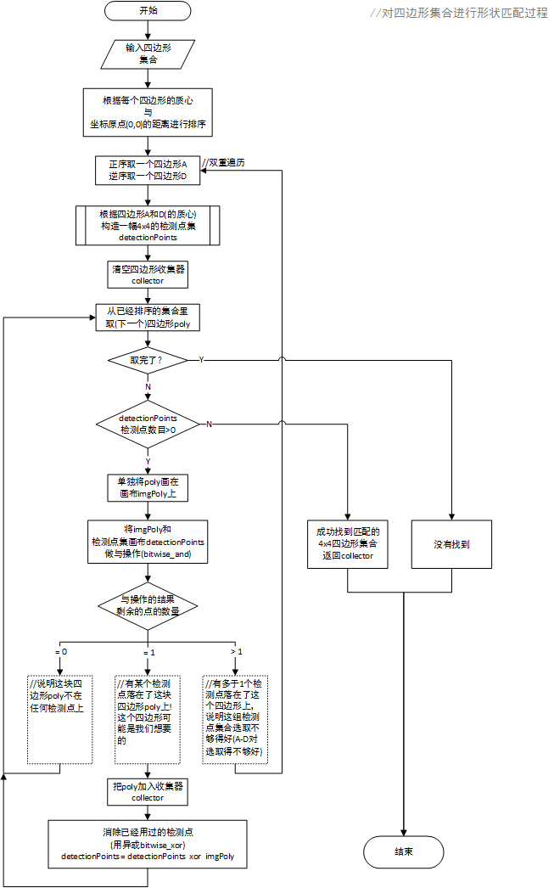
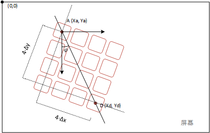
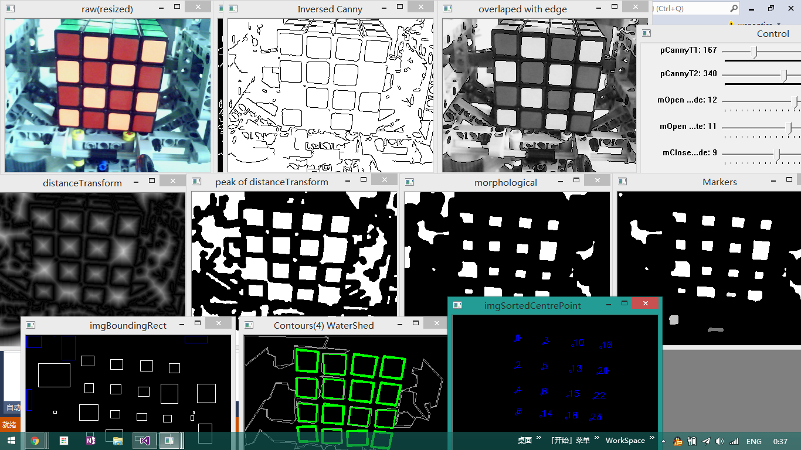
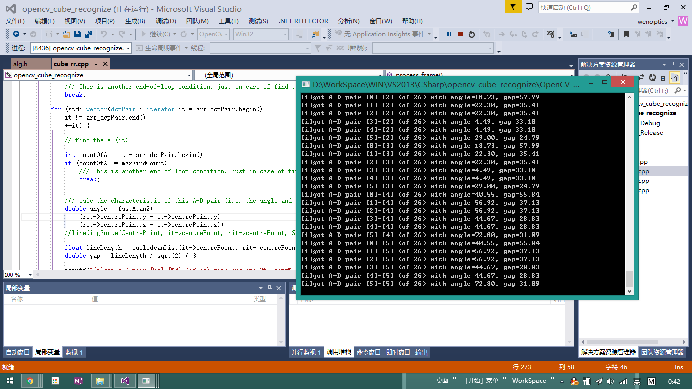

# Rubiks-Revenge-OpenCV

In associate with my [LEGO Rubik's Revenge Solver](https://github.com/wenoptics/Rubiks-Cube-Robot)

The following description is abridged from my essay.

 YouTube

---

  此程序使用OpenCV 3.1.0 (C++), 在Visual Studio 2013上调试，应用了Canny边缘增强、distanceTransform(距离变换)和watershed alg(分水岭算法)等过程，下图的流程图简述了实现思路。

  其中的“对四边形集合进行形状匹配”的过程是一个将给定四边形集合进行排序，然后分别正序和逆序进行遍历，以查找出假定魔方面块的左上（块A）和右下（块D）的子过程。其实现思路如流程图阐述。

  其中根据四边形A和D的质心来构造的4x4的检测点集，是以A、D点的坐标为输入，计算4x4检测点的起点位置、点间隔与旋转角度，最终输出一个与原图像等大的、4x4个1px的检测点图像的的子函数。下图示意了A点、D点的含义，以及旋转角度和间隙的计算说明等。

## Screenshots:

 A-D pair debug

